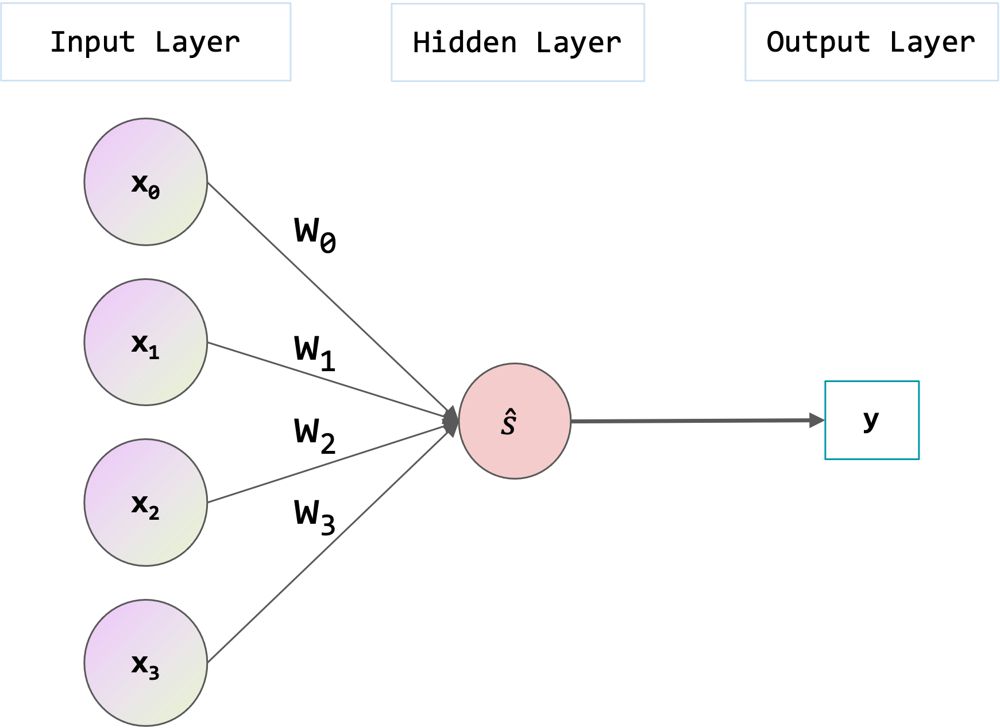

# Statistical Theories for Brain and Parallel Computing -- Assignment1

@import "../name.md"

---

## Data and Methods

### Network

I constructed a network as shown in the figure.



|value name|variable|description|
|--|--|--|
|input|$x_n$|$x_n \in \lbrace 0, 1 \rbrace$|
|weight|$w_n$|$w_n \in U(-1, 1)$|
|output|$y$|$y_n \in \lbrace 0, 1 \rbrace$|
|gain|$\alpha$|$\alpha > 0$|

### Fomula

$$
\begin{align}
    \hat{s} &= \displaystyle \sum_{n=0}^N w_{n}x_{n} \quad (N = 3) \cr
    p
        &= sigmoid(\hat{s}) \cr
        &= \frac{a}{1 + e^{- \alpha \hat{s}}} \cr
    y &=
    \begin{cases}
        0 & P(0) = 1 - \textit{p} \cr
        1 & P(1) = \textit{p}
    \end{cases}
\end{align}
$$

## Results

Randomly determine and fix $x_{n}$ and $w_{n}$ in given conditions.At this time, observe how the output frequency of $y = 0, 1$ changes by changing $\alpha = 0.1, 1, 2, 5$. Also, change $trial = 100, 1000, 10000$ for each $\alpha$ and check the ratio of outputting $y = 1$. The results are as follows.

$\hat{s} > 0 \quad(p > 0.5)$
```bash
gain: 0.1, trial: 100, probability: 0.5053458175979504, ratio of the value 1 : 0.48
gain: 0.1, trial: 1000, probability: 0.5053458175979504, ratio of the value 1 : 0.509
gain: 0.1, trial: 10000, probability: 0.5053458175979504, ratio of the value 1 : 0.5055
gain: 1, trial: 100, probability: 0.5532574216935245, ratio of the value 1 : 0.55
gain: 1, trial: 1000, probability: 0.5532574216935245, ratio of the value 1 : 0.576
gain: 1, trial: 10000, probability: 0.5532574216935245, ratio of the value 1 : 0.5522
gain: 2, trial: 100, probability: 0.6053199452311429, ratio of the value 1 : 0.7
gain: 2, trial: 1000, probability: 0.6053199452311429, ratio of the value 1 : 0.609
gain: 2, trial: 10000, probability: 0.6053199452311429, ratio of the value 1 : 0.5967
gain: 5, trial: 100, probability: 0.7444455589084145, ratio of the value 1 : 0.63
gain: 5, trial: 1000, probability: 0.7444455589084145, ratio of the value 1 : 0.737
gain: 5, trial: 10000, probability: 0.7444455589084145, ratio of the value 1 : 0.7405
```

$\hat{s} < 0 \quad(p < 0.5)$
```bash
gain: 0.1, trial: 100, probability: 0.47326028052325025, ratio of the value 1 : 0.4
gain: 0.1, trial: 1000, probability: 0.47326028052325025, ratio of the value 1 : 0.48
gain: 0.1, trial: 10000, probability: 0.47326028052325025, ratio of the value 1 : 0.4767
gain: 1, trial: 100, probability: 0.2552870535584264, ratio of the value 1 : 0.24
gain: 1, trial: 1000, probability: 0.2552870535584264, ratio of the value 1 : 0.245
gain: 1, trial: 10000, probability: 0.2552870535584264, ratio of the value 1 : 0.2583
gain: 2, trial: 100, probability: 0.10515449343961247, ratio of the value 1 : 0.08
gain: 2, trial: 1000, probability: 0.10515449343961247, ratio of the value 1 : 0.103
gain: 2, trial: 10000, probability: 0.10515449343961247, ratio of the value 1 : 0.1036
gain: 5, trial: 100, probability: 0.004711383663726527, ratio of the value 1 : 0.0
gain: 5, trial: 1000, probability: 0.004711383663726527, ratio of the value 1 : 0.002
gain: 5, trial: 10000, probability: 0.004711383663726527, ratio of the value 1 : 0.004
```

## Disuccusion

* When $\hat{s} > 0$, $p$ increased as $\alpha$ increased.
Also, as $trial$ increased, the rate at which $y$ output 1 asymptotically approached $p$.

* When $\hat{s} < 0$, $p$ decreased as $\alpha$ increased.
Also, as $trial$ increased, the rate at which $y$ output 1 asymptotically approached $p$.
