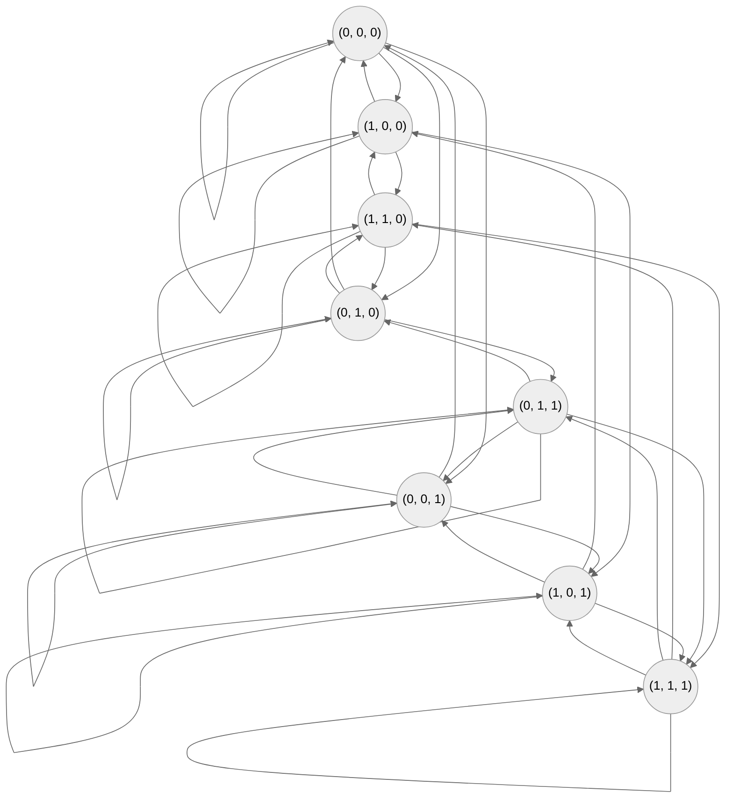

# Assignment2

$$
\begin{cases}
2 x_1 - x_2 + x_3 = 2\\
2 x_1 - x_2 + x_3 = -1\\
2 x_1 - x_2 + x_3 = 1
\end{cases}
$$

上記の方程式を満たす$(x_1, x_2, x_3)$を見つけよ。

1. 決定論的モデルを使用することによって上記の方程式を解くRNNを構築せよ。
2. 確率的モデルを使用して、$N(x_1, x_2, x_3)$がボルツマン分布に従っているかを確認せよ。Gibbs Copies = 100, 1000 実験的な結果と$N(x_1, x_2, x_3)$の理論値を比較せよ。初期値やゲイン$\alpha$を自由に変えることができる。解は最も大きい$N(x_1, x_2, x_3)$の数の状態によって与えられる。

$$
\begin{align*}
   \alpha
   &= \frac{1}{kT}\\
   N(x_1, x_2, x_3)
   &= A e^{-E(x_1, x_2, x_3)}\\
   A
   &= \frac{N_{total}}{\sum_{}^{\bm{x}} e^{- \alpha E(\bm{x})}}\\
   N(\bm{x})
   &= A e^{- \alpha E(\bm{x})}\\
   \int_{\bm{x}} N(\bm{x})
   &= \int_{\bm{x}} A e^{- \alpha E(\bm{x})}\\
   &= A \int_{\bm{x}} e^{- \alpha E(\bm{x})}\\
   M(E)
   &= Ae^{- \alpha E} \Delta E\\
   &= N(\bm{x}) \Delta E\\
   \hat{S_n}
   &= \sum_{i=0}^{3} w_{in} x_{i}\\
   p
   &= sigmoid(\hat{S_n})\\
   &= \frac{1}{1+e^{- \alpha \hat{S}}}\\
   M_{total}
   &= \int_{- \infty}^{\infty} Ae^{- \alpha E} dE\\
   &= \sum_{i} \hat{A} e^{\alpha E_i}\\
   \hat{A}
   &= A \Delta E_i\\
   E(\bm{x})
   &= - \frac{1}{2} \sum_{n=0}^{N} \sum_{m=0}^{N} w_{nm} x_m x_n + C\\
   \Delta E
   &= E(\bm{x}(t + 1)) - E(\bm{x}(t))
\end{align*}
$$

エルゴート性が満たされているのならば、ただ一つのRNNによって生み出された状態の時系列を利用することができる。我々は多くのcopyを必要としない。ところでエルゴート性とは何だろうか？
エルゴート性 = ensamble(gibbs copy の組) statistics(分布、平均、共分散など) = temporal(生み出された状態の時系列) statistics

`statisical ensamble(統計的集団)`

巨視的に同じ条件下にある系を集めた集団

`temporal statistics(時系列統計情報)`

巨視的に同じ条件下にある系を集めた集団

`temporal data`

時系列データ

temporal statics

a single RNN

`Aeterministic model`
ハミング距離が1以下の状態同士全てに経路を持つグラフ

ensamble statics を計算するとき、多くのcopyが必要となる。

* 他の状態に遷移ができない状態(これがグローバルミニマムになる)
* 他の状態から遷移できない状態も存在

quiz??
copyの状態の更新を何度も繰り返すとどうなりますか？
