# Statistical Theories for Brain and Parallel Computing -- Assignment2

@import "../name.md"

---

$$
\begin{cases}
2 x_1 - x_2 + x_3 = 2\\\\
2 x_1 - x_2 + x_3 = -1\\\\
2 x_1 - x_2 + x_3 = 1
\end{cases}
$$

上記の方程式を満たす$(x_1, x_2, x_3)$の解の組みを求めよ。

## part1 問題

決定論的モデルを使用することによって上記の方程式を解くRNNを構築せよ。また、初期値、更新順序によってとりうるEが最小値になるか局所解になるかどうかを確認せよ。また、Eが更新により単調減少するかどうかを確認せよ。

## part2 問題

確率論的モデルを使用して、$N(x_1, x_2, x_3)$がボルツマン分布に従っているかを確認せよ。Gibbs Copies = 100, 1000 とする。実験的な結果と$N(x_1, x_2, x_3)$の理論値を比較せよ。初期値やゲイン$\alpha$を自由に変えることができる。解は最も大きい$N(x_1, x_2, x_3)$の数の状態によって与えられる。

## part3 問題

part2の確率論的モデルがエルゴード性を満たしているか確認せよ。

|$w_{nm}$|0|1|2|3|
|--|--|--|--|--|
|0|0|-6|16|-5|
|1|-6|0|10|-8|
|2|16|10|0|8|
|3|-5|-8|8|0|

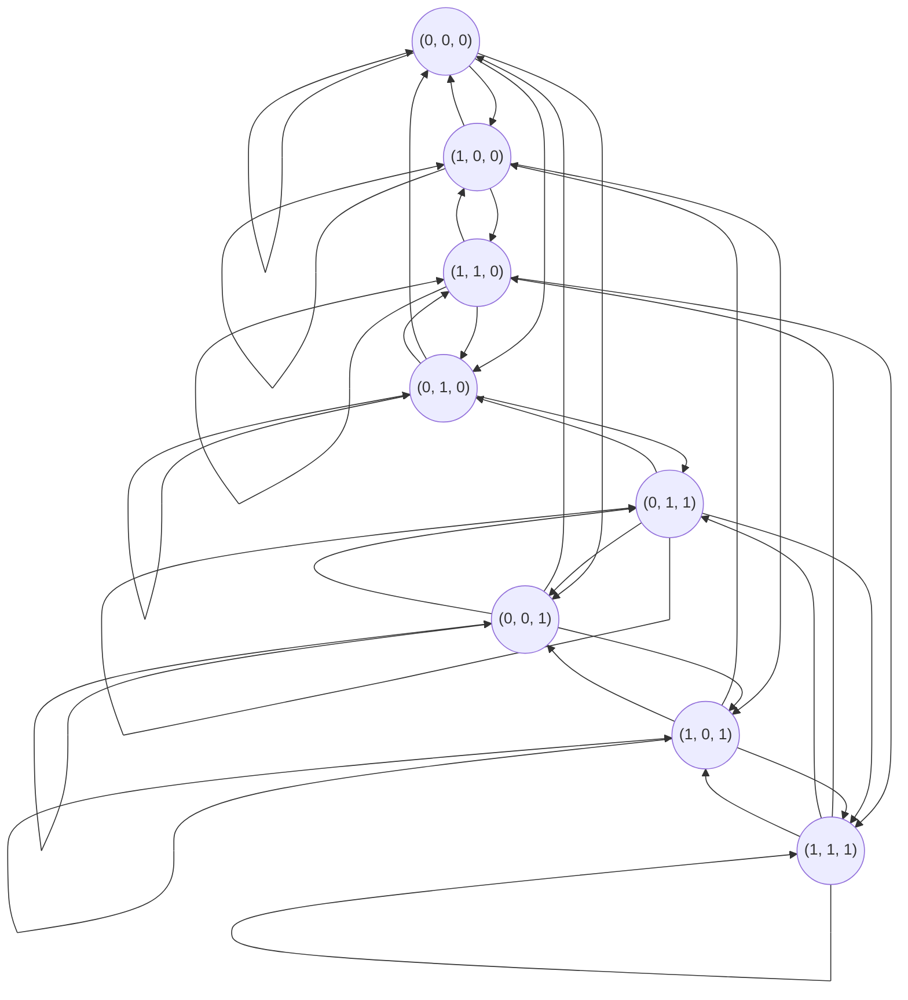

## part1 解答

### Results

更新の順番

|initial value set\update order|$x_1, x_2, x_3$|
|:--|:--|
|(0, 0, 0)||
|(0, 0, 1)||
|(0, 1, 0)||
|(0, 1, 1)||
|(1, 0, 0)||
|(1, 0, 1)||
|(1, 1, 0)||
|(1, 1, 1)||

|initial value set\update order|$x_1, x_3, x_2$|
|:--|:--|
|(0, 0, 0)||
|(0, 0, 1)|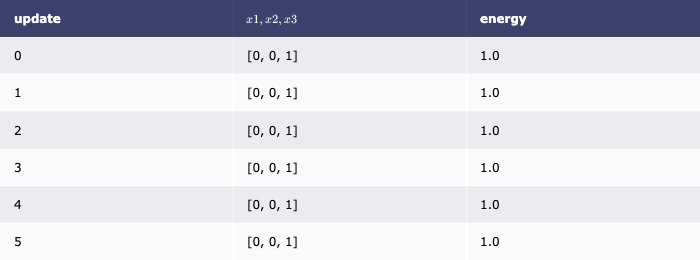|
|(0, 1, 0)|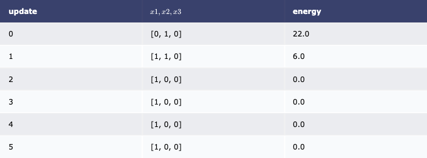|
|(0, 1, 1)||
|(1, 0, 0)||
|(1, 0, 1)|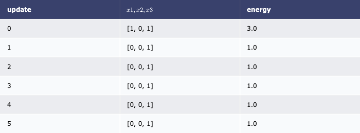|
|(1, 1, 0)||
|(1, 1, 1)||

|initial value set\update order|$x_2, x_1, x_3$|
|:--|:--|
|(0, 0, 0)||
|(0, 0, 1)||
|(0, 1, 0)|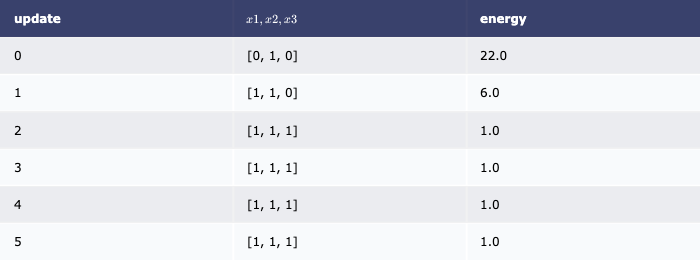|
|(0, 1, 1)||
|(1, 0, 0)||
|(1, 0, 1)||
|(1, 1, 0)||
|(1, 1, 1)||

|initial value set\update order|$x_2, x_3, x_1$|
|:--|:--|
|(0, 0, 0)||
|(0, 0, 1)||
|(0, 1, 0)|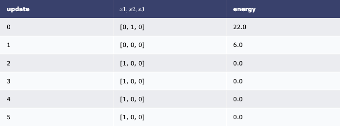|
|(0, 1, 1)|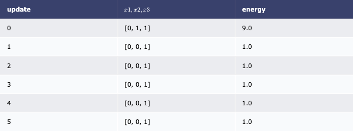|
|(1, 0, 0)||
|(1, 0, 1)||
|(1, 1, 0)|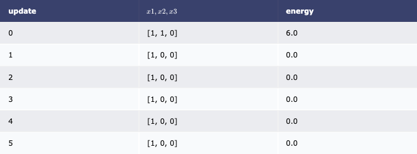|
|(1, 1, 1)||

|initial value set\update order|$x_3, x_1, x_2$|
|:--|:--|
|(0, 0, 0)||
|(0, 0, 1)||
|(0, 1, 0)|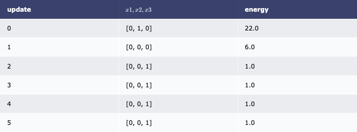|
|(0, 1, 1)||
|(1, 0, 0)|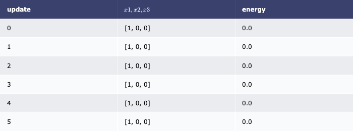|
|(1, 0, 1)||
|(1, 1, 0)||
|(1, 1, 1)||

|initial value set\update order|$x_3, x_2, x_1$|
|:--|:--|
|(0, 0, 0)||
|(0, 0, 1)||
|(0, 1, 0)||
|(0, 1, 1)|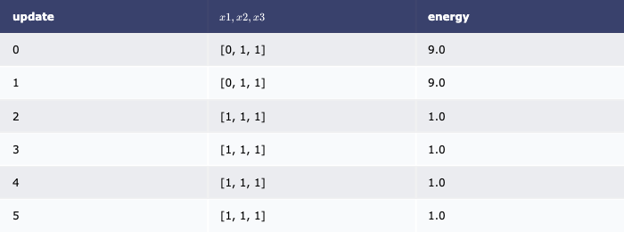|
|(1, 0, 0)||
|(1, 0, 1)||
|(1, 1, 0)||
|(1, 1, 1)||

### Discussion

* 更新するニューロンの順番によらず、エネルギーは必ず減少することが確認できる。
* 更新するニューロンがによって、局所最適解となる。局所解は、$E(0, 0, 1) = E(1, 1, 1) = 1$であり、$E(1, 0, 0) = 0$の次にエネルギーが低い。局所解の状態とハミング距離が1にある他の状態は全て、局所解の状態よりもエネルギーが高く、これ以上状態の更新が起こることがないことが原因であると考えられる。

## part2 / part3 解答

### Results

Gibbs Copy = 100, update = 100

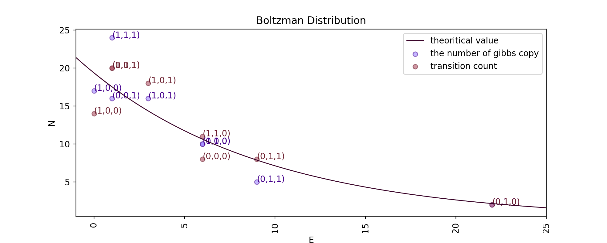

|$(x_1, x_2, x_3)$|energy|gibbs copies(theoretical)|gibbs copies(actual)|transition|solution|
|:--|--:|--:|--:|--:|--:|
|(0, 0, 0)|6.0|10.624582115481221|10|8||
|(0, 0, 1)|1.0|17.516974526094053|16|20||
|(0, 1, 0)|22.0|2.1450661342639483|2|2||
|(0, 1, 1)|9.0|7.870884018277601|5|8||
|(1, 0, 0)|0.0|19.3592508189111|17|14||
|(1, 0, 1)|3.0|14.341685745396811|16|18||
|(1, 1, 0)|6.0|10.624582115481221|10|11||
|(1, 1, 1)|1.0|17.516974526094053|24|20|◯|

Gibbs Copy = 1000, update = 1000

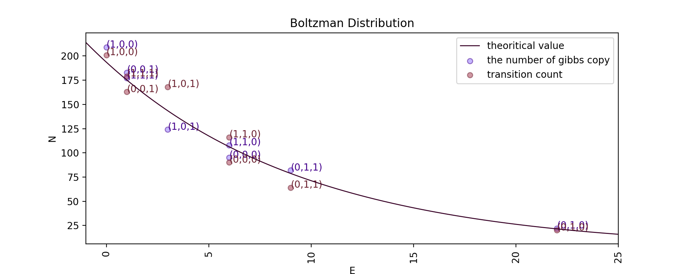

|$(x_1, x_2, x_3)$|energy|gibbs copies(theoretical)|gibbs copies(actual)|transition|solution|
|:--|--:|--:|--:|--:|--:|
|(0, 0, 0)|6.0|106.24582115481222|95|90||
|(0, 0, 1)|1.0|175.16974526094057|183|163||
|(0, 1, 0)|22.0|21.450661342639485|22|20||
|(0, 1, 1)|9.0|78.70884018277602|82|64||
|(1, 0, 0)|0.0|193.59250818911102|209|201|◯|
|(1, 0, 1)|3.0|143.4168574539681|124|168||
|(1, 1, 0)|6.0|106.24582115481222|108|116||
|(1, 1, 1)|1.0|175.16974526094057|177|179||

* gibbs copy = 100における解は、$(x_1, x_2, x_3) = (1, 1, 1)$となり、これは正規の解と不一致である。gibbs copy = 1000における解は$(x_1, x_2, x_3) = (1, 0, 0)$となることがわかり、これは正規の解に一致する。
* gibbs copy = 100, 1000 共におおよそ$N(x_1, x_2, x_3)$はボルツマン分布に従っている。
* 各状態におけるgibbs copyの数の分布とgibbs copyの遷移時の時系列分布は一致しているといえる。そのため、このRNNはエルゴード性を満たしている。

### Discussion

* gibbs copy = 100の時に注目すると、本来の解である$(x_1, x_2, x_3) = (1, 0, 0)$ではなく、局所解である$(x_1, x_2, x_3) = (1, 1, 1)$となってている。これは、updateの数が少ないためだと考えられる。更新回数が少ない場合、偶然辿り着いた状態で粒子が留まってしまいそれが更新しきらないまま、試行回数が終了となってしまうため、局所解に陥りやすい。
* gibbs copy = 100の時のグラフに注目すると、理論値周辺におおよそ分布しているものの、gibbs copy = 1000の時に比べ理論値からの分散が大きいことがわかる。これは、gibbs copyの数が少ないためだと考えられる。gibbs copyの総数が十分に多くない時、1つあたりの粒子が全体に与える影響が大きく、誤差が大きくなりやすい。実際にgibbs copy = 1000に注目すると、理論値からの分散が小さくなっていることがわかる。
* 時系列特性に着目すると、gibbs copy = 100, 1000で互いに近い値を持っていることがわかる。これはgibbs copy, update数が増えるほど顕著になり、ボルツマン分布に従い、かつエルゴード性を満たす。
