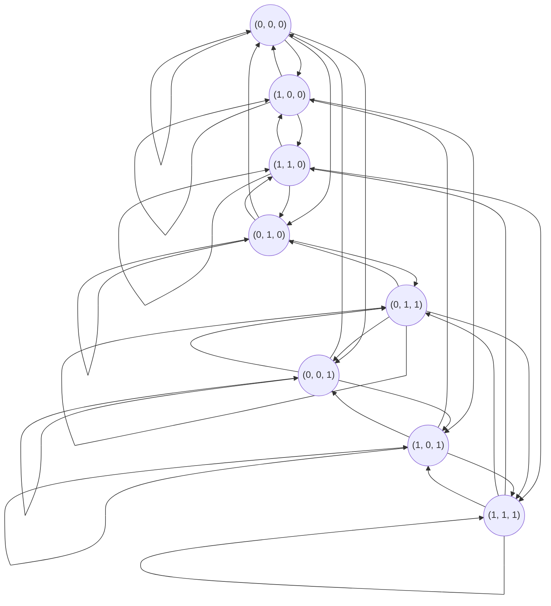
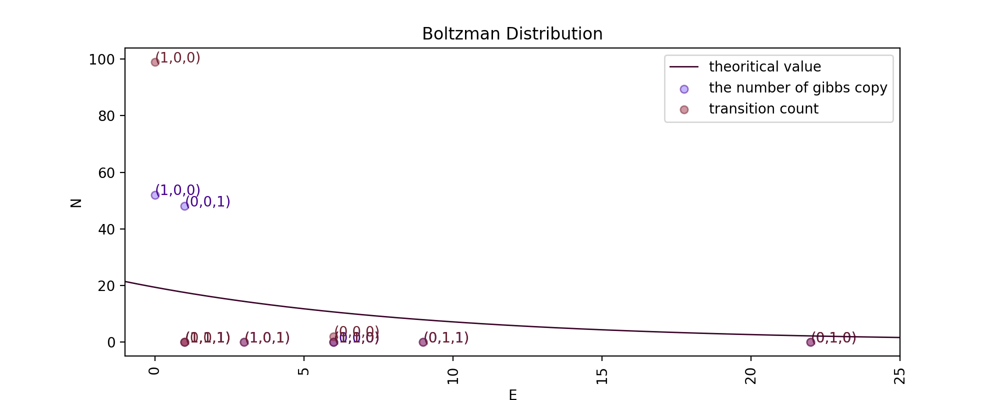
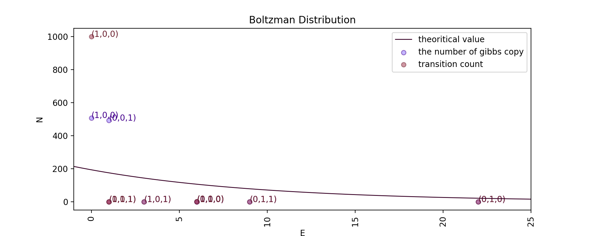

# Statistical Theories for Brain and Parallel Computing -- Assignment2

@import "../name.md"

---

$$
\begin{cases}
2 x_1 - x_2 + x_3 = 2\\\\
2 x_1 - x_2 + x_3 = -1\\\\
2 x_1 - x_2 + x_3 = 1
\end{cases}
$$

上記の方程式を満たす$(x_1, x_2, x_3)$の解の組みを求めよ。

1. 決定論的モデルを使用することによって上記の方程式を解くRNNを構築せよ。
2. 確率的モデルを使用して、$N(x_1, x_2, x_3)$がボルツマン分布に従っているかを確認せよ。Gibbs Copies = 100, 1000 とする。実験的な結果と$N(x_1, x_2, x_3)$の理論値を比較せよ。初期値やゲイン$\alpha$を自由に変えることができる。解は最も大きい$N(x_1, x_2, x_3)$の数の状態によって与えられる。

|$w_{nm}$|0|1|2|3|
|--|--|--|--|--|
|0|0|-6|16|-5|
|1|-6|0|10|-8|
|2|16|10|0|8|
|3|-5|-8|8|0|

## 1. 決定論的モデルの解法

### Results

Gibbs Copy = 100, update = 100

|$(x_1, x_2, x_3)$|energy|gibbs copies|solution|
|:--|--:|--:|--:|
|(0, 0, 0)|6.0|0||
|(0, 0, 1)|1.0|48||
|(0, 1, 0)|22.0|0||
|(0, 1, 1)|9.0|0||
|(1, 0, 0)|0.0|52|◯|
|(1, 0, 1)|3.0|0||
|(1, 1, 0)|6.0|0||
|(1, 1, 1)|1.0|0||

Gibbs Copy = 1000, update = 1000

|$(x_1, x_2, x_3)$|energy|gibbs copies|solution|
|:--|--:|--:|--:|
|(0, 0, 0)|6.0|0||
|(0, 0, 1)|1.0|492||
|(0, 1, 0)|22.0|0||
|(0, 1, 1)|9.0|0||
|(1, 0, 0)|0.0|508|◯|
|(1, 0, 1)|3.0|0||
|(1, 1, 0)|6.0|0||
|(1, 1, 1)|1.0|0||

* gibbs copy = 100, 1000における解は、$(x_1, x_2, x_3) = (1, 0, 0)$となり、これは正規の解に一致する。

### Discussion

* 期待通りの解が得られたが、何度か実験を行うと$(0, 0, 1)$に最も多くのgibbs copyが集まってしまうことがあった。これはエネルギーが$(1, 0, 0)$の次に低い値($E(1, 0, 0) = 0, E(0, 0, 1) = E(1, 1, 1) = 1$)であったため、局所解にはまってしまったものだと考えられる。
* $E(0, 0, 1) = E(1, 1, 1)$であるにも関わらず、(1, 1, 1)に集まるgibbs copyが存在しないのは、初期状態として与えた$(0, 0, 0)$とハミング距離が大きく離れており、また到達するための経路が存在しなかったためだと考えられる。$(1, 1, 1)$に到達するまでに経由しなければならない状態が、その一つ前の状態より必ずエネルギーが高くなっていることがテーブルからみて取れる。決定論的モデルではエネルギーがより高い状態に遷移を行わないため、今回のRNNでは、$(0, 0, 0)$から$(1, 1, 1)$に到達する経路が存在しない。

## 2. 確率論的モデルの解法

### Results

Gibbs Copy = 100, update = 100

|$(x_1, x_2, x_3)$|energy|gibbs copies(theoretical)|gibbs copies(actual)|transition|solution|
|:--|--:|--:|--:|--:|--:|
|(0, 0, 0)|6.0|10.624582115481221|10|8||
|(0, 0, 1)|1.0|17.516974526094053|16|20||
|(0, 1, 0)|22.0|2.1450661342639483|2|2||
|(0, 1, 1)|9.0|7.870884018277601|5|8||
|(1, 0, 0)|0.0|19.3592508189111|17|14||
|(1, 0, 1)|3.0|14.341685745396811|16|18||
|(1, 1, 0)|6.0|10.624582115481221|10|11||
|(1, 1, 1)|1.0|17.516974526094053|24|20|◯|

Gibbs Copy = 1000, update = 1000

|$(x_1, x_2, x_3)$|energy|gibbs copies(theoretical)|gibbs copies(actual)|transition|solution|
|:--|--:|--:|--:|--:|--:|
|(0, 0, 0)|6.0|106.24582115481222|95|90||
|(0, 0, 1)|1.0|175.16974526094057|183|163||
|(0, 1, 0)|22.0|21.450661342639485|22|20||
|(0, 1, 1)|9.0|78.70884018277602|82|64||
|(1, 0, 0)|0.0|193.59250818911102|209|201|◯|
|(1, 0, 1)|3.0|143.4168574539681|124|168||
|(1, 1, 0)|6.0|106.24582115481222|108|116||
|(1, 1, 1)|1.0|175.16974526094057|177|179||

* gibbs copy = 100における解は、$(x_1, x_2, x_3) = (1, 1, 1)$となり、これは正規の解と不一致である。gibbs copy = 1000における解は$(x_1, x_2, x_3) = (1, 0, 0)$となることがわかり、これは正規の解に一致する。
* gibbs copy = 100, 1000 共におおよそ$N(x_1, x_2, x_3)$はボルツマン分布に従っている。
* 各状態におけるgibbs copyの数の分布とgibbs copyの遷移時の時系列分布は一致しているといえる。そのため、このRNNはエルゴード性を満たしている。

### Discussion

* gibbs copy = 100の時に注目すると、本来の解である$(x_1, x_2, x_3) = (1, 0, 0)$ではなく、局所解である$(x_1, x_2, x_3) = (1, 1, 1)$となってている。これは、updateの数が少ないためだと考えられる。更新回数が少ない場合、偶然辿り着いた状態で粒子が留まってしまいそれが更新しきらないまま、試行回数が終了となってしまうため、局所解に陥りやすい。
* gibbs copy = 100の時のグラフに注目すると、理論値周辺におおよそ分布しているものの、gibbs copy = 1000の時に比べ理論値からの分散が大きいことがわかる。これは、gibbs copyの数が少ないためだと考えられる。gibbs copyの総数が十分に多くない時、1つあたりの粒子が全体に与える影響が大きく、誤差が大きくなりやすい。実際にgibbs copy = 1000に注目すると、理論値からの分散が小さくなっていることがわかる。
* 時系列特性に着目すると、gibbs copy = 100, 1000で互いに近い値を持っていることがわかる。これはgibbs copy, update数が増えるほど顕著になり、ボルツマン分布に従い、かつエルゴード性を満たす。
