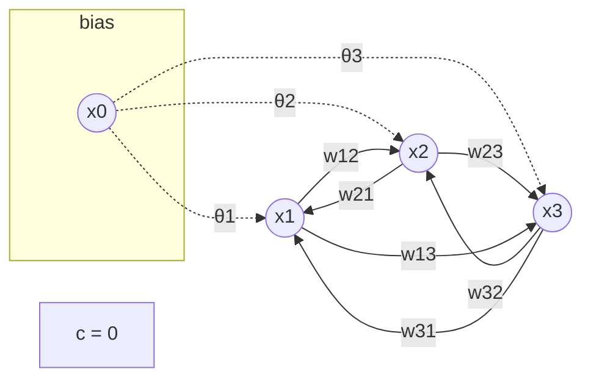

# Statistical Theories for Brain and Parallel Computing -- quiz4

@import "../name.md"

---

## Formula

$$
\begin{cases}
    2x_1 - x_2 + x_3 = 2 \cr
    -x_1 + x_2 - x_3 = -1 \cr
    x_1 - 2x_2 + x_3 = 1 \cr
\end{cases}
$$

## Energy Function

### general Form

$$
\begin{aligned}
    E
    &= -\frac{1}{2} \sum_{n = 0}^{N} \sum_{m = 0}^{N} w_{nm}x_{n}x_{m} + c \quad (N = 3, w_{nn} = 0, w_{nm} = w_{mn}) \cr
    &= -\frac{1}{2} \sum_{n = 1}^{N} \sum_{m = 1}^{N} w_{nm}x_{n}x_{m} + \sum_{n = 1}^{N} \theta_{n}x_{n} + c
\end{aligned}
$$

### for this problem

$$
E = (2x_1 - x_2 + x_3 - 2)^2 + (-x_1 + x_2 - x_3 + 1)^2 + (x_1 - 2x_2 + x_3 - 1)^2
$$

## Network

## Connect weight, threshold, constant

|$\theta_{n}$|1|2|3|
|--|--|--|--|
|n|-6|16|-5|

|$w_{nm}$|$m = 1$|2|3|
|--|--|--|--|
|$n = 1$|0|10|-8|
|2|10|0|8|
|3|-8|8|0|

$c = 6$

[mermaid reference](https://github.com/mermaid-js/mermaid/issues/39)
